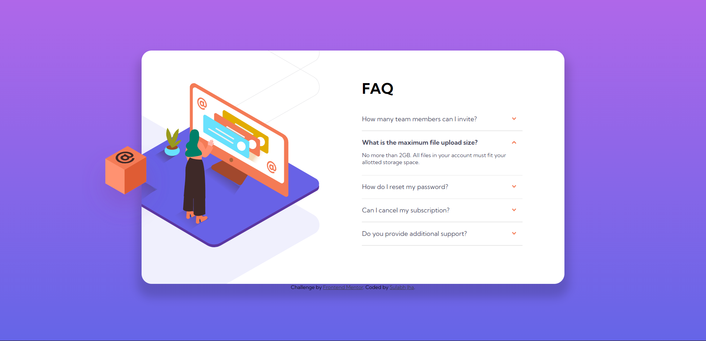

# Frontend Mentor - FAQ accordion card solution

This is a solution to the [FAQ accordion card challenge on Frontend Mentor](https://www.frontendmentor.io/challenges/faq-accordion-card-XlyjD0Oam). Frontend Mentor challenges help you improve your coding skills by building realistic projects. 

## Table of contents

- [Overview](#overview)
  - [The challenge](#the-challenge)
  - [Screenshot](#screenshot)
  - [Links](#links)
- [My process](#my-process)
  - [Built with](#built-with)
- [Author](#author)

## Overview

### The challenge

Users should be able to:

- View the optimal layout for the component depending on their device's screen size
- See hover states for all interactive elements on the page
- Hide/Show the answer to a question when the question is clicked
- Without Javascript 

### Screenshot

### Links

- Solution URL: [Click here](https://github.com/sulabh007/faq-accordion-card-main-without-Javascript)
- Live Site URL: [Click URL here](https://sulabh007.github.io/faq-accordion-card-main-without-Javascript/)
-The solution with Javascript: [Click URL here](https://github.com/sulabh007/faq-accordion-card-Javascript-)
## My process

### Built with

- Semantic HTML5 markup
- CSS custom properties
- Flexbox
- CSS Grid
- Mobile-first workflow

## Author

- Website - [sulabh007](https://github.com/sulabh007)
- Frontend Mentor - [@sulabh007](https://www.frontendmentor.io/profile/sulabh007)
